# Hi, I'm Syed Zulqarnain Hassan 👋🏼

### 🤖 AI/ML Engineer · 📊 Data Scientist · 📍 New York

*Turning research into production — LLM applications, RAG systems, and end-to-end machine learning.*

Data scientist by training, builder by habit — I like models that actually make it to production.

  

<h3><code>zulqarnain@github:~$ whoami --verbose</code></h3>

 

 

<h3><code>zulqarnain@github:~$ snake --feed ./contributions</code></h3>

  

<h3><code>zulqarnain@github:~$ ls -la ./projects</code></h3>

open: [JobCraft](https://github.com/Zulqarnain-10/JobCraft) · [MedBot](https://github.com/Zulqarnain-10/AI-Powered-Medical-Chatbot-Using-LLM-s-for-Smart-Healthcare-Assistance) · [Material Classifier](https://github.com/Zulqarnain-10/Advanced-Material-Classification-Using-Sensor-Fusion-Machine-Learning)

  

<h3><code>zulqarnain@github:~$ cat tech-stack.txt</code></h3>

  

<h3><code>zulqarnain@github:~$ ./connect.sh</code></h3>

 

*Let's build something intelligent.* 🚀

Thanks for scrolling all the way down — the terminal's always open. ☕

  

Everything above is self-generated animated SVG — no third-party stats services, no tokens. A tiny Python pipeline in <a href="scripts">scripts/</a> draws it, and <a href=".github/workflows">two GitHub Actions</a> keep it fresh every day.

<code>zulqarnain@github:~$ exit</code>

