# Hi, I'm Syed Zulqarnain Hassan 👋

### 🤖 AI/ML Engineer · 📊 Data Scientist · 📍 Dix Hills, New York

*Turning research into production — LLM applications, RAG systems, and end-to-end machine learning.*

 

<h3><code>zulqarnain@github:~$ ./contributions.sh --last-year</code></h3>

  

<h3><code>zulqarnain@github:~$ whoami</code></h3>

<table>
<tr>
<td valign="top"></td>
<td valign="top"></td>
</tr>
</table>

 

<h3><code>zulqarnain@github:~$ ls ./flagship-projects</code></h3>

🤖 **[JobCraft](https://github.com/Zulqarnain-10/JobCraft)** — AI-agent job-search platform: resume analysis, job matching across LinkedIn/Indeed/Glassdoor, and interview prep in one Streamlit app.
&nbsp;&nbsp;&nbsp;&nbsp;`LangChain` · `OpenAI` · `FAISS` · `Streamlit`

🩺 **[MedBot](https://github.com/Zulqarnain-10/AI-Powered-Medical-Chatbot-Using-LLM-s-for-Smart-Healthcare-Assistance)** — RAG medical Q&A assistant that grounds every answer in a medical reference to reduce hallucination.
&nbsp;&nbsp;&nbsp;&nbsp;`LangChain` · `Pinecone` · `OpenAI` · `Flask`

♻️ **[Advanced Material Classification](https://github.com/Zulqarnain-10/Advanced-Material-Classification-Using-Sensor-Fusion-Machine-Learning)** — CNN + multi-sensor fusion recycling sorter (~96% accuracy) on a Raspberry Pi + Arduino rig.
&nbsp;&nbsp;&nbsp;&nbsp;`TensorFlow` · `Keras` · `Computer Vision` · `IoT`

 

<h3><code>zulqarnain@github:~$ cat tech-stack.txt</code></h3>

**Languages**

**Machine Learning & Deep Learning**

**LLMs & Generative AI**

**Vector Databases**

**Backend, Cloud & Data**

 

<h3><code>zulqarnain@github:~$ ./connect.sh</code></h3>

 

*Let's build something intelligent.* 🚀

Everything above is self-generated animated SVG — no third-party stats services, no tokens. A tiny Python pipeline in <a href="scripts">scripts/</a> draws it, and <a href=".github/workflows/update-profile-art.yml">a GitHub Action</a> refreshes the contribution graph every day.

